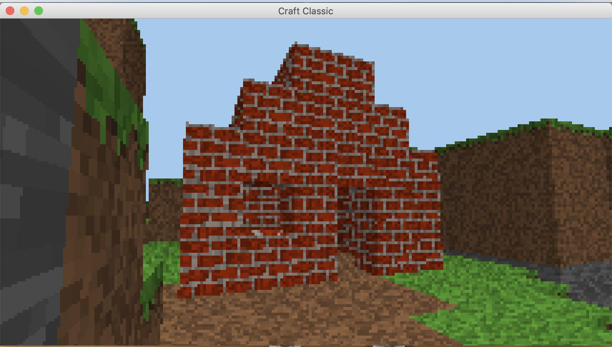
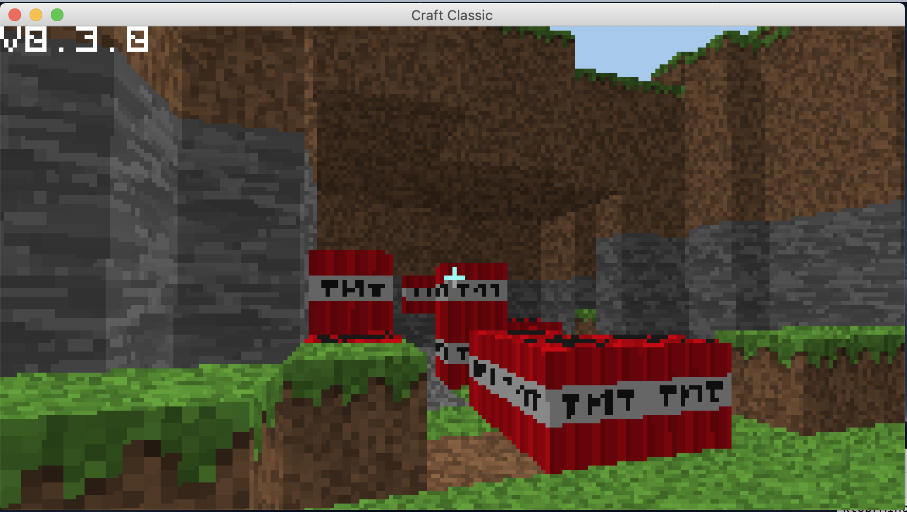
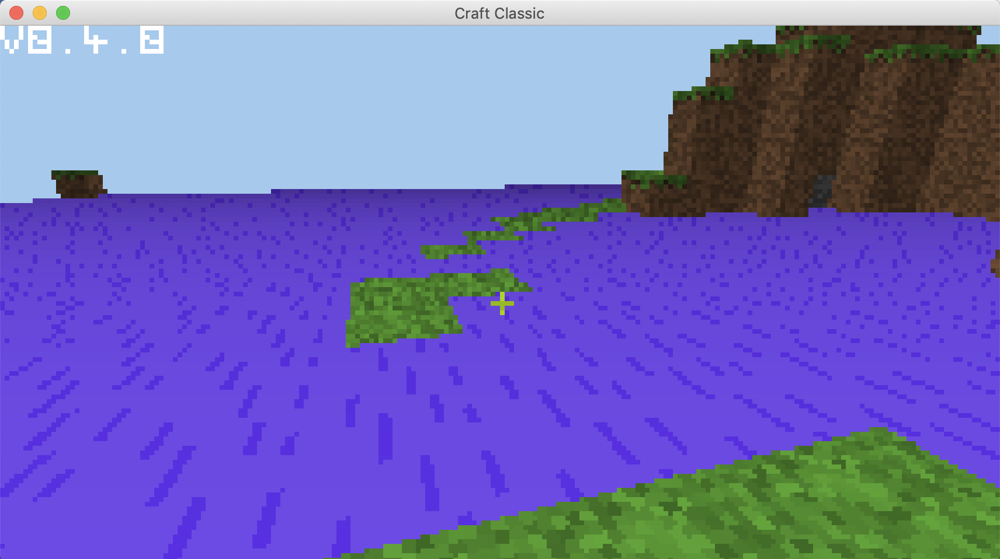
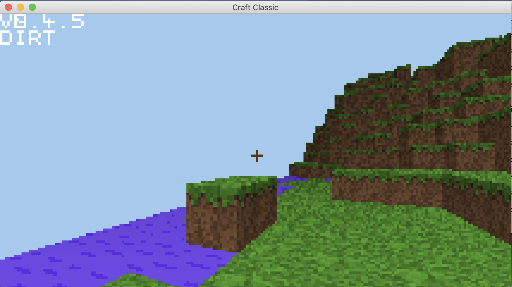
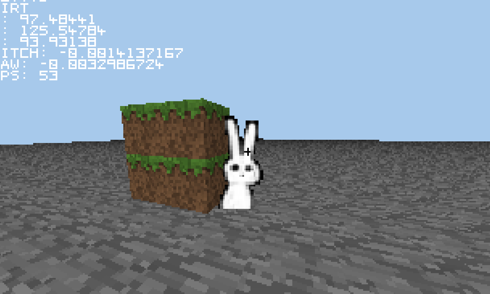

# Retro Craft
A Voxel based game that uses no libraries that has an 80's theme.
This means that No libraries or frameworks like openGL or Unity were used

[](https://www.youtube.com/watch?v=m63pDKehByg)

[Youtube video of Retro Craft](https://img.youtube.com/vi/m63pDKehByg/0.jpg)

## How to install
Just go to releases and download the jar
[OR CLICK HERE TO DOWNLOAD THE JAR](https://github.com/HeathLoganCampbell/Retro-Craft/releases/download/v0.4.5/MincraftClassic.jar)
## How to play
```
W = forwards
S = backwards
A = left
D = right
left mouse button = break block
right mouse button = place block
right arrow key = changed block placed 
```

## Development

### Things to add
* Entities
* Multiplayer support
* Fix mouse issue for windows
* make ticks more consitant
* Fragment up the Minecraft class so it's more understable
* Title screen
* Chunkize the world
* Make particles
* Generate trees
* Make it so you swim in lava
* Make it so Bigger Y = higher up

## Versions

### v0.1.5
[It's just a bad version of minecraft, example](https://gyazo.com/d123022c618a0574954187d86f35e100)

### v0.2.0
[Example](https://gyazo.com/3a32f4017e7bda57560eb9ce96a4ce16)

### v0.2.1

* Added the ability to change different block types
* Fix grass spawning throughout all dirt blocks

Issuses Still around
* windows doesn't set the location of the mouse correctly

### v0.3.0

* Add tnt that explodes in chain
* Add glass
* String rendering engine
* added cross hair

### v0.4.0

* Water that flows
* lava that flows

### v0.4.5

* water is now naturally generated in the land
* there is a preview of what block you'll place

### Renamed to Retro Craft
Because it sounded better

### v0.5.0 [2/11/2022]

* Added sprites
* Add Multiplayer abilities
* remove mouse control
